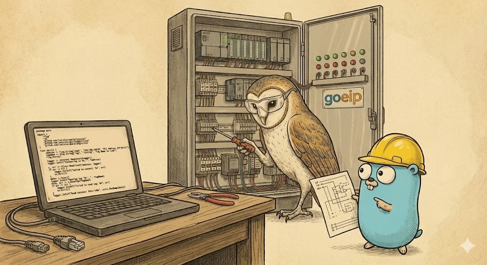

# goeip - Native Go EtherNet/IP Implementation

`goeip` is a pure Go implementation of the EtherNet/IP protocol, supporting both Explicit Messaging (UCMM) and Implicit Messaging (Cyclic I/O). It is designed to be a flexible and performant library for building EtherNet/IP Scanners and Adapters.



## Features

- **Encapsulation Protocol**: Full support for CIP encapsulation over TCP.
- **Explicit Messaging**: SendRRData, SendUnitData, and UCMM support.
- **Implicit Messaging (Class 1 I/O)**:
  - UDP I/O on port 2222.
  - RPI-based scheduling.
  - Run/Idle Header support.
  - Connection Timeout Watchdog.
- **CIP Objects**:
  - Identity Object (0x01)
  - Message Router (0x02)
  - Assembly Object (0x04)
  - Connection Manager (0x06)
  - CIP Symbol Object (0x6B) - Tag Enumeration
- **Tools**:
  - `scanner`: A CLI tool to initiate connections and exchange I/O.
  - `adapter`: A CLI tool to act as a target device.
  - `list_identity`: Enumerates the Identity Object of a target.
  - `list_tags`: Lists all tags (symbols) on a Logix controller.
  - `read_tag_single`: Reads tag values from a target (supports arrays).
  - `write_tag_single`: Writes a single tag value to a target.

## Documentation

Detailed documentation for specific components can be found in the `docs/` directory:

- **Start Here**: [Basic Usage](docs/basics.md) - A beginner's guide to Connecting, Reading, and Writing.
- [Connection Manager](docs/connection_manager.md): Details on Forward_Open, Large_Forward_Open, and Connection Lifecycle.
- [Assembly Object](docs/assembly_object.md): Usage of Input, Output, and Configuration Assemblies.
- [Implicit Messaging](docs/implicit_messaging.md): Architecture of the UDP I/O runtime and Scheduler.
- [Tag Types](docs/tag_types.md): Mapping of CIP data types to Go types.
- [Tools & Usage](docs/tools.md): Guides for using the `scanner` and `adapter` CLI tools.
- [Tag Monitor](docs/tag_monitor.md): Poll tags on schedules and build state-driven applications.
- [Custom Types](docs/custom_types.md): Implementing Marshaler/Unmarshaler for custom structs.
- [Handling Disconnects](docs/handling_disconnects.md): Using reconnecting transports and best practices.
- [Logix Timer Structure](docs/timer_structure.md): Details on Timer (TON/TOF/RTO) support.

## Quick Start

### Building the Tools

```bash
go build -o scanner ./cmd/scanner
go build -o adapter ./cmd/adapter
```

### Running an Adapter (Target)

Start an adapter listening on TCP 44818 and UDP 2222, with Input Assembly 100 and Output Assembly 150:

```bash
./adapter --addr :44818 --udp-addr :2222 --input-assembly 100 --output-assembly 150
```

### Running a Scanner (Originator)

Start a scanner to connect to the adapter and exchange data every 100ms:

```bash
./scanner --addr 127.0.0.1:44818 --input-assembly 100 --output-assembly 150 --rpi 100ms
```

## License

MIT
