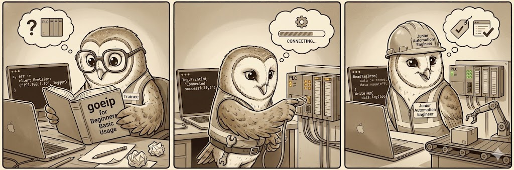

# Basic Usage

This guide covers the fundamental operations for communicating with a Logix controller using `goeip`.



## 1. Connecting to a PLC

The `client.Client` is the primary entry point for Explicit Messaging. It establishes a TCP connection to the PLC and manages the CIP session.

### Creating a Client

```go
package main

import (
    "log"
    "github.com/iceisfun/goeip/pkg/client"
    "github.com/iceisfun/goeip/internal"
)

func main() {
    // 1. Create a Logger
    logger := internal.NewConsoleLogger()

    // 2. Connect to the PLC
    // Replace with your PLC's IP address
    c, err := client.Connect("192.168.1.10", logger)
    if err != nil {
        log.Fatalf("Failed to connect: %v", err)
    }
    // Always ensure you close the client to release the session
    defer c.Close()

    log.Println("Connected successfully!")
}
```

## 2. Reading Tags

There are two main ways to read tags: `ReadTag` (raw bytes) and `ReadTagInto` (structured data).

### Reading Raw Bytes

Use `ReadTag` if you want the raw data or need to handle the decoding yourself.

```go
data, err := c.ReadTag("MyDINT")
if err != nil {
    log.Fatal(err)
}
log.Printf("Raw bytes: %X", data)
```

### Reading into Go Variables

Use `ReadTagInto` to automatically decode the response into a standard Go variable.

```go
// Reading a generic integer
var myVal int32
err := c.ReadTagInto("MyTag", &myVal)

// Reading a float
var myFloat float32
err := c.ReadTagInto("MyReal", &myFloat)

// Reading a boolean
var myBool bool
err := c.ReadTagInto("MyBool", &myBool)
```

### Reading Arrays

Use `ReadTagElements` or `ReadTagElementsInto` to read multiple elements from an array tag.

```go
// Reading raw bytes (21 DINT elements = 84 bytes + 2 byte type header)
data, err := c.ReadTagElements("MyDINTArray", 21)

// Reading into a Go array
var alarms [21]int32
err := c.ReadTagElementsInto("MyDINTArray", 21, &alarms)

// Reading a single element by index still works
var element int32
err := c.ReadTagInto("MyDINTArray[5]", &element)
```

### Reading Structures

You can also read entire structures if you define a compatible Go struct.

```go
// PLC UDT:
// MyUDT
//   Count: DINT
//   Rate: REAL

type MyUDT struct {
    Count int32
    Rate  float32
}

var udt MyUDT
err := c.ReadTagInto("MyUDTTag", &udt)
```

## 3. Writing Tags

Use `WriteTag` to send values to the PLC. You must assume the data type on the Go side matches the tag type on the PLC.

```go
// Write a DINT (int32)
err := c.WriteTag("MyDINT", int32(100))

// Write a REAL (float32)
err := c.WriteTag("MyReal", float32(12.34))

// Write a BOOL
err := c.WriteTag("MyBool", true)

// Write a STRING
err := c.WriteTag("MyString", "Hello World")
```

## Need More?

- **Cyclic I/O**: Check out the [Implicit Messaging](implicit_messaging.md) guide.
- **Robustness**: See [Handling Disconnects](handling_disconnects.md).
