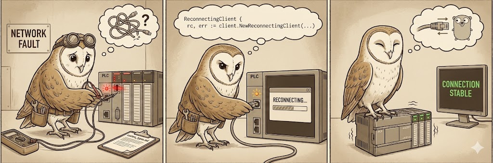

# Handling Disconnects and Reconnections

The standard `client.Connect()` creates a direct connection to the PLC. If this connection is severed (e.g., due to network interruptions, PLC power cycle, or timeout), the client enters a failed state where all subsequent operations return errors.

For long-running applications that need to survive network outages, use a reconnecting transport with retry options.



## Using Reconnecting Transport

`goeip` provides a `NewReconnectingTransport` that lazily connects and automatically re-creates sessions when they fail. Pair it with `WithRetries` on the client to control how many times operations are retried.

### Basic Usage

```go
package main

import (
    "log"
    "time"

    "github.com/iceisfun/goeip/pkg/client"
)

func main() {
    // Create a reconnecting transport (connects lazily, never fails)
    t := client.NewReconnectingTransport("192.168.1.10", nil)

    // Create client with retry options
    c := client.NewClient(t,
        client.WithRetries(5),
        client.WithRetryDelay(2 * time.Second),
    )
    defer c.Close()

    // Use c just like a regular client — all methods support retries
    val, err := c.ReadTag("MyTag")
    if err != nil {
        log.Printf("Read failed after retries: %v", err)
    } else {
        log.Printf("Read success: %v", val)
    }
}
```

### Lifecycle Hooks

You can monitor connection state with `WithOnConnect` and `WithOnDisconnect`:

```go
t := client.NewReconnectingTransport("192.168.1.10", logger,
    client.WithOnConnect(func() {
        log.Println("connected to PLC")
    }),
    client.WithOnDisconnect(func(err error) {
        log.Printf("disconnected from PLC: %v", err)
    }),
)
c := client.NewClient(t, client.WithRetries(-1))  // infinite retries
```

### With TagMonitor

`TagMonitor` works with any `*client.Client`, including those backed by a reconnecting transport:

```go
// Create reconnecting client
t := client.NewReconnectingTransport("192.168.1.10", logger)
c := client.NewClient(t, client.WithRetries(5))

// Create TagMonitor — the client handles reconnection transparently
monitor, err := client.NewTagMonitor(c)
if err != nil {
    log.Fatal(err)
}

// Add tags and wait...
```

## Manual Handling

If you prefer to manage connections yourself, you should monitor the errors returned by `ReadTag` or `WriteTag`. If an error indicates a transport failure (e.g., `io.EOF`, `broken pipe`), you must:

1. Close the existing client (`client.Close()`).
2. Create a new client (`client.Connect(...)`).
3. Retry the operation with the new client.

The reconnecting transport implements this exact pattern for you.
