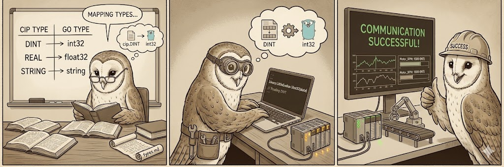

# CIP Tag Types and Go Types

When reading or writing tags using `goeip`, it is important to understand how CIP data types map to Go types. The library defines specific types in the `pkg/cip` package to represent these values.



## Elementary Data Types

The following table lists the supported elementary CIP data types and their corresponding Go types in `goeip`.

| CIP Data Type | Code | Description | Go Type (`pkg/cip`) | Go Native Type |
|---|---|---|---|---|
| **BOOL** | `0xC1` | Boolean | `BOOL` | `bool` (usually) |
| **SINT** | `0xC2` | Short Integer (8-bit) | `SINT` | `int8` |
| **INT** | `0xC3` | Integer (16-bit) | `INT` | `int16` |
| **DINT** | `0xC4` | Double Integer (32-bit) | `DINT` | `int32` |
| **LINT** | `0xC5` | Long Integer (64-bit) | `LINT` | `int64` |
| **USINT** | `0xC6` | Unsigned Short Integer (8-bit) | `USINT` | `uint8` |
| **UINT** | `0xC7` | Unsigned Integer (16-bit) | `UINT` | `uint16` |
| **UDINT** | `0xC8` | Unsigned Double Integer (32-bit) | `UDINT` | `uint32` |
| **ULINT** | `0xC9` | Unsigned Long Integer (64-bit) | `ULINT` | `uint64` |
| **REAL** | `0xCA` | Floating Point (32-bit) | `REAL` | `float32` |
| **LREAL** | `0xCB` | Double Floating Point (64-bit) | `LREAL` | `float64` |
| **BYTE** | `0xD1` | Bit String (8-bit) | `BYTE` | `byte` (`uint8`) |
| **WORD** | `0xD2` | Bit String (16-bit) | `WORD` | `uint16` |
| **DWORD** | `0xD3` | Bit String (32-bit) | `DWORD` | `uint32` |
| **LWORD** | `0xD4` | Bit String (64-bit) | `LWORD` | `uint64` |

## String Types

String handling in CIP can vary. The standard types are:

| CIP Data Type | Code | Description | Go Type | Notes |
|---|---|---|---|---|
| **STRING** | `0xD0` | Character String (1-byte per char) | `string` | Standard ASCII string. Structure: `[Len:UINT] [Data:Byte...]` |
| **STRING2** | `0xD5` | Character String (2-byte per char) | `string` | Unicode string. |
| **SHORT_STRING** | `0xDA` | Short String (1-byte len) | `string` | Structure: `[Len:USINT] [Data:Byte...]` |

## Constructed Data Types

### Arrays

Arrays are sequences of elements of the same type. Use `ReadTagElements` or `ReadTagElementsInto` to read multiple elements at once.

```go
// Read 10 DINT elements into a Go array
var values [10]int32
err := c.ReadTagElementsInto("MyDINTArray", 10, &values)

// Read raw bytes (includes 2-byte type header)
data, err := c.ReadTagElements("MyDINTArray", 10)
// data[0:2] = type code (0xC4 0x00 for DINT)
// data[2:] = 40 bytes of DINT data (10 elements × 4 bytes)
```

Array responses include the base type code (e.g., `0x00C4` for DINT). The array bit (`0x8000`) is used internally but the response contains just the element type.

### Structures

Structures are sequences of members of potentially different types. Define a matching Go struct to unmarshal them.

## Usage in Code

When using `read_tag_single` or implementing custom tag reading logic, you will encounter these types.

### Example: Reading a DINT

If you read a tag that is a `DINT`, the response data will be 4 bytes (Little Endian).

```go
import (
    "encoding/binary"
    "github.com/iceisfun/goeip/pkg/cip"
)

// ... response data from Read Tag ...
var value cip.DINT
if typeCode == cip.TypeDINT {
    value = cip.DINT(binary.LittleEndian.Uint32(data))
}
```

### Example: Writing a REAL

To write a `REAL` value:

```go
import (
    "encoding/binary"
    "math"
    "github.com/iceisfun/goeip/pkg/cip"
)

var myVal cip.REAL = 123.456
data := make([]byte, 4)
binary.LittleEndian.PutUint32(data, math.Float32bits(float32(myVal)))
```
